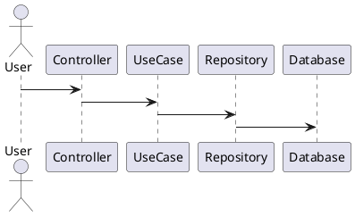
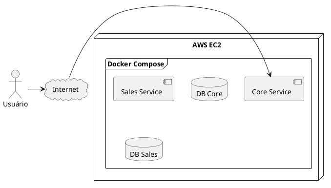

# 🚗 CarStore (Core Service) — Plataforma de Revenda de Veículos

Este repositório contém o **Core Service** (serviço principal) do projeto **CarStore**, desenvolvido em **Spring Boot** seguindo **Clean Architecture**, com testes automatizados e pipeline de **CI/CD**.

> **Escopo deste microserviço (Core Service):**
> - **Gestão de usuários**: criação/edição (inclui controle de acesso por role).
> - **Cadastro e manutenção de veículos**: cadastrar e editar dados do veículo para venda.
> - **Endpoint fake para simular webhook**: este serviço também disponibiliza um endpoint **simulador** para representar o callback do provedor de pagamento (útil para testes ponta-a-ponta).
>
> As funcionalidades de **compra/listagens e fluxo de venda** ficam no **Sales Service (CarStoreView)**, com **banco segregado** e comunicação via HTTP.

---

## 📦 FASE 4 — Contexto do Projeto

Uma empresa de revenda de veículos necessita de uma plataforma online para cadastro, venda e consulta de veículos.  
A solução foi implementada utilizando **microsserviços independentes**, cada um com banco segregado e comunicação via HTTP.

Principais necessidades do negócio (visão geral do ecossistema):
- Cadastro e edição de veículos
- Efetivação de venda e confirmação/cancelamento de pagamento via webhook
- Listagens (disponíveis e vendidos) ordenadas por preço

---

## 🧱 Clean Architecture

O projeto segue os princípios de **Clean Architecture**, separando responsabilidades em camadas:

```
adapter   → Controllers e interfaces externas
usecase   → Regras de negócio
data      → DTOs e persistência
infra     → Configurações (segurança, banco, JWT)
```

### 📐 Diagrama (Clean Architecture)



---

## 🏗️ Arquitetura de Microsserviços (FASE 4)

A solução é composta por dois serviços:

- **Core Service (este repositório)** → usuários + cadastro/edição de veículos + endpoint fake de webhook (simulador)
- **Sales Service (CarStoreView)** → compra/listagens + integração de venda com banco segregado

```plantuml
@startuml
actor Cliente

rectangle "Core Service (este repo)" as core
rectangle "Sales Service (CarStoreView)" as sales

database "DB Core" as dbcore
database "DB Sales" as dbsales

Cliente -> core : Cadastro/edição
Usuários e veículos
core -> dbcore

core -> sales : HTTP REST
(chamadas entre serviços)
sales -> dbsales
@enduml
```

---

## ☁️ Deploy (Docker Compose na EC2)



---

## ▶️ Executando Localmente

### ✅ Pré-requisitos

- Java 24
- Docker + Docker Compose
- Git

Verifique:

```bash
java -version
docker --version
docker compose version
```

### 📄 Variáveis de ambiente

Edite o arquivo `.env` (ou crie a partir de um `.env.example`, se você mantiver esse template):

```bash
nano ..env
```

Exemplo (mínimo para rodar local):
```
DB_HOST=db
DB_PORT=5432
DB_NAME=soat7
DB_USER=postgres
DB_PASSWORD=postgres
SPRING_PROFILES_ACTIVE=postgres
APP_PORT_PUBLISHED=8080
DB_PORT_PUBLISHED=5432
```

### 🐳 Rodar com Docker (recomendado)

```bash
docker compose up --build
```

### 💻 Rodar sem Docker (banco em Docker + app local)

Subir somente o banco:

```bash
docker compose up db -d
```

Subir a aplicação:

```bash
./mvnw spring-boot:run
```

---

## 📖 Swagger / OpenAPI

Após subir a aplicação, acesse:

- **Swagger UI:** `http://localhost:8080/swagger-ui/index.html`
- **OpenAPI JSON:** `http://localhost:8080/v3/api-docs`

---

## 🧪 Testes

```bash
./mvnw test
```

---

## 🔄 CI/CD (GitHub Actions)

Este repositório utiliza GitHub Actions para:

- Rodar testes automaticamente
- (Opcional) Rodar análise de qualidade (SonarCloud)
- Build da imagem Docker
- Push para o Amazon ECR
- Deploy automático na EC2 com Docker Compose

### ✅ Gatilho do pipeline

O workflow é disparado quando ocorre **push/merge na branch `main`**:

- **Merge de Pull Request → main** (recomendado)
- **Push direto → main** (não recomendado, mas também dispara)

> Arquivo do workflow: `.github/workflows/ci-cd-ec2.yml`

Fluxo (alto nível):
```
push na main → testes → (sonar) → build docker → push ECR → deploy EC2
```

---

## 🔐 Criar Secrets via CLI (gh) para o Actions

Você pode cadastrar todas as secrets do repositório usando o **GitHub CLI**.

### 1) Autenticar

```bash
gh auth login
```

### 2) Criar secrets manualmente (exemplo)

```bash
gh secret set AWS_REGION --body "sa-east-1"
gh secret set EC2_HOST  --body "SEU_IP_DA_EC2"
```

### 3) Importar em lote a partir do `.env` (recomendado)

Se você tiver o script `import-secrets.sh` no repositório:

```bash
chmod +x import-secrets.sh
./import-secrets.sh
```

> O script lê o `.env`, ignora comentários e cria as secrets automaticamente via `gh secret set`.

---

## 📚 Tecnologias

- Java 24
- Spring Boot
- PostgreSQL
- Docker / Docker Compose
- PlantUML
- GitHub Actions
- SonarCloud (opcional)
- JUnit + Mockito

---


---

## 🔐 Nota de Segurança (Contexto Acadêmico)

Este projeto inclui **chaves JWT de desenvolvimento** no repositório **exclusivamente para fins acadêmicos**.

- As chaves foram geradas apenas para este trabalho
- Não possuem relação com chaves pessoais, SSH ou credenciais AWS
- Não dão acesso à máquina do autor ou a infraestrutura real
- Serão descartadas após a conclusão do projeto

> ⚠️ Em ambientes de produção, chaves privadas nunca devem ser versionadas em repositórios.


## 👨‍💻 Autor

Leandro Shiniti Tacara  
RM355388  
Pós Tech FIAP — Turma SOAT7
