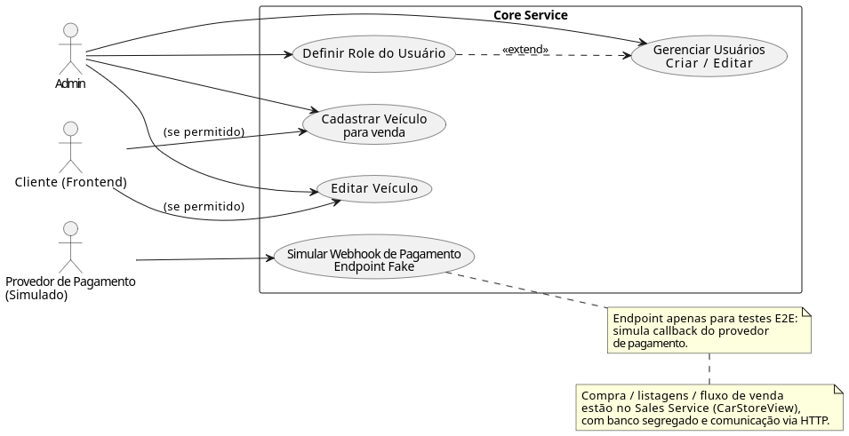
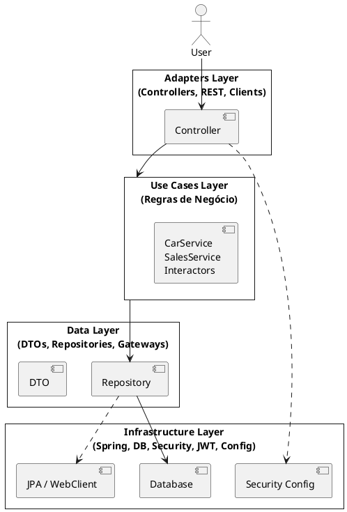
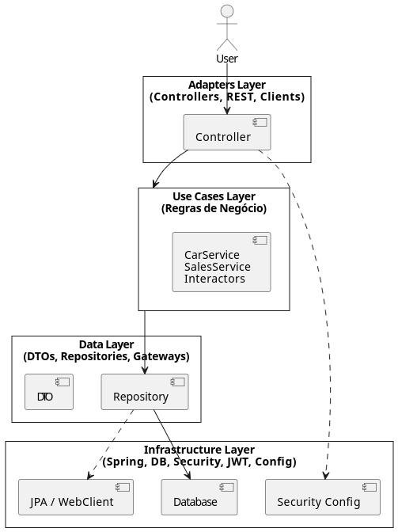
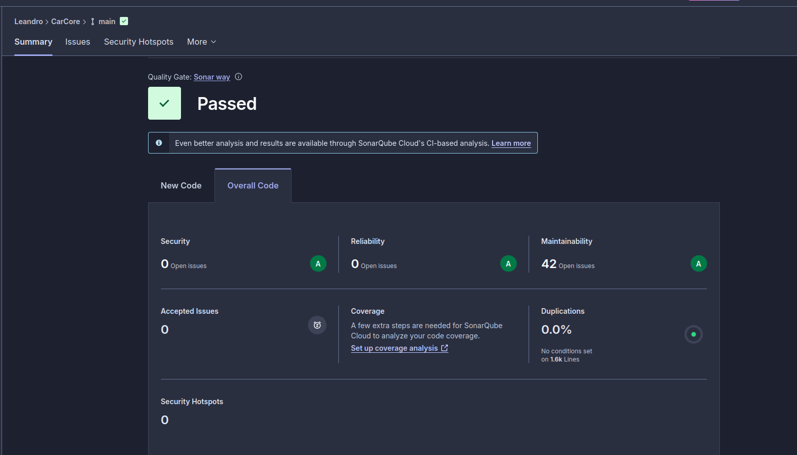

# 🚗 CarStore (Core Service) — Plataforma de Revenda de Veículos

Este repositório contém o **Core Service** (serviço principal) do projeto **CarStore**, desenvolvido em **Spring Boot** seguindo **Clean Architecture**, com testes automatizados e pipeline de **CI/CD**.

> **Escopo deste microserviço (Core Service):**
> - **Gestão de usuários**: criação/edição (inclui controle de acesso por role).
> - **Cadastro e manutenção de veículos**: cadastrar e editar dados do veículo para venda.
> - **Endpoint fake para simular webhook**: este serviço também disponibiliza um endpoint **simulador** para representar o callback do provedor de pagamento (útil para testes ponta-a-ponta).
>
> As funcionalidades de **compra/listagens e fluxo de venda** ficam no **Sales Service (CarStoreView)**, com **banco segregado** e comunicação via HTTP.



---

## 📦 FASE 4 — Contexto do Projeto

Uma empresa de revenda de veículos necessita de uma plataforma online para cadastro, venda e consulta de veículos.  
A solução foi implementada utilizando **microsserviços independentes**, cada um com banco segregado e comunicação via HTTP.

Principais necessidades do negócio (visão geral do ecossistema):
- Cadastro e edição de veículos
- Efetivação de venda e confirmação/cancelamento de pagamento via webhook
- Listagens (disponíveis e vendidos) ordenadas por preço


---

## 🧱 Clean Architecture

O projeto segue os princípios de **Clean Architecture**, separando responsabilidades em camadas:

```
adapter   → Controllers e interfaces externas
usecase   → Regras de negócio
data      → DTOs e persistência
infra     → Configurações (segurança, banco, JWT)
```

### 📐 Diagrama (Clean Architecture)


[imagem do diagrama de camadas da Clean Architecture]



---

## 🏗️ Arquitetura de Microsserviços (FASE 4)

A solução é composta por dois serviços:

- **Core Service (este repositório)** → usuários + cadastro/edição de veículos + endpoint fake de webhook (simulador)
- **Sales Service (CarStoreView)** → compra/listagens + integração de venda com banco segregado


---

## ☁️ Deploy (Docker Compose na EC2)
- O deploy é feito utilizando **Docker Compose** em uma instância EC2, com pipeline de CI/CD configurado para:
- Rodar testes
- Build da imagem Docker
- Push para o Amazon ECR
- Deploy automático na EC2
- O pipeline é disparado automaticamente em **push/merge na branch `main`**.

---

## ▶️ Executando Localmente

- Para rodar localmente, você pode usar o **Docker Compose** (recomendado) ou rodar a aplicação localmente com o banco em Docker.
- Certifique-se de ter as variáveis de ambiente configuradas corretamente (ver seção abaixo) para garantir que a aplicação consiga se conectar ao banco e funcione conforme esperado.
- O endpoint fake de webhook pode ser testado localmente usando ferramentas como **Postman** ou **curl**, simulando as chamadas do provedor de pagamento.
- Após subir a aplicação, acesse o **Swagger UI** para explorar os endpoints e testar as funcionalidades de cadastro/edição de veículos e simulação do webhook.
- Lembre-se de que o fluxo de compra e listagens está isolado no Sales Service (CarStoreView), então para testar essas funcionalidades, você precisará subir ambos os serviços e garantir que eles estejam se comunicando corretamente via HTTP.
- Certifique-se de que o banco de dados esteja rodando e acessível para a aplicação, seja via Docker Compose ou outro método, para evitar erros de conexão.
- Ao rodar localmente, fique atento às portas configuradas para evitar conflitos com outros serviços que possam estar utilizando as mesmas portas.
- Para testes ponta-a-ponta, certifique-se de que ambos os serviços (Core e Sales) estejam rodando e configurados para se comunicarem corretamente, especialmente no que diz respeito às URLs e portas utilizadas para as chamadas HTTP entre eles.

### ✅ Pré-requisitos

- Java 24
- Docker + Docker Compose
- Git

Verifique:

```bash
java -version
docker --version
docker compose version
```

### 📄 Variáveis de ambiente

Edite o arquivo `.env` (ou crie a partir de um `.env.example`, se você mantiver esse template):

```bash
nano ..env
```

Exemplo (mínimo para rodar local):
```
DB_HOST=db
DB_PORT=5432
DB_NAME=soat7
DB_USER=postgres
DB_PASSWORD=postgres
SPRING_PROFILES_ACTIVE=postgres
APP_PORT_PUBLISHED=8080
DB_PORT_PUBLISHED=5432
```

### 🐳 Rodar com Docker (recomendado)

```bash
docker compose up --build
```

### 💻 Rodar sem Docker (banco em Docker + app local)

Subir somente o banco:

```bash
docker compose up db -d
```

Subir a aplicação:

```bash
./mvnw spring-boot:run
```

---

## 📖 Swagger / OpenAPI

Após subir a aplicação, acesse:

- **Swagger UI:** `http://localhost:8080/swagger-ui/index.html`
- **OpenAPI JSON:** `http://localhost:8080/v3/api-docs`

---

## 🧪 Testes

```bash
./mvnw test
```

---

## 🔄 CI/CD (GitHub Actions)

Este repositório utiliza GitHub Actions para:

- Rodar testes automaticamente
- (Opcional) Rodar análise de qualidade (SonarCloud)
- Build da imagem Docker
- Push para o Amazon ECR
- Deploy automático na EC2 com Docker Compose

### ✅ Gatilho do pipeline

O workflow é disparado quando ocorre **push/merge na branch `main`**:

- **Merge de Pull Request → main** (recomendado)
- **Push direto → main** (não recomendado, mas também dispara)

> Arquivo do workflow: `.github/workflows/ci-cd-ec2.yml`

Fluxo (alto nível):
```
push na main → testes → (sonar) → build docker → push ECR → deploy EC2
```

---

## 🔐 Criar Secrets via CLI (gh) para o Actions

Você pode cadastrar todas as secrets do repositório usando o **GitHub CLI**.

### 1) Autenticar

```bash
gh auth login
```

### 2) Criar secrets manualmente (exemplo)

```bash
gh secret set AWS_REGION --body "sa-east-1"
gh secret set EC2_HOST  --body "SEU_IP_DA_EC2"
```

### 3) Importar em lote a partir do `.env` (recomendado)

Se você tiver o script `import-secrets.sh` no repositório:

```bash
chmod +x import-secrets.sh
./import-secrets.sh
```

> O script lê o `.env`, ignora comentários e cria as secrets automaticamente via `gh secret set`.

---

## 📚 Tecnologias

- Java 24
- Spring Boot
- PostgreSQL
- Docker / Docker Compose
- PlantUML
- GitHub Actions
- SonarCloud (opcional)
- JUnit + Mockito

---


---

## 🔐 Nota de Segurança (Contexto Acadêmico)

Este projeto inclui **chaves JWT de desenvolvimento** no repositório **exclusivamente para fins acadêmicos**.

- As chaves foram geradas apenas para este trabalho
- Não possuem relação com chaves pessoais, SSH ou credenciais AWS
- Não dão acesso à máquina do autor ou a infraestrutura real
- Serão descartadas após a conclusão do projeto

> ⚠️ Em ambientes de produção, chaves privadas nunca devem ser versionadas em repositórios.


## 👨‍💻 Autor

Leandro Shiniti Tacara  
RM355388  
Pós Tech FIAP — Turma SOAT7


## ☁️ Requisitos para execução na AWS (EC2)

Para executar e publicar via CI/CD (GitHub Actions) em uma instância EC2:

- **Instância**: `t3.small`
- **EC2 com IP público** (Elastic IP opcional, mas recomendado para estabilidade)
- **Docker + Docker Compose** instalados na EC2
- **Security Group** liberando:
  - **SSH (22)** a partir do seu IP (administração)
  - **Portas da aplicação** (ex.: `8080` no Core, `8081` no Sales)
  - Permitir o deploy do **GitHub Actions** (via SSH) — recomenda-se restringir a origem aos **GitHub Actions IP ranges** ou usar **runner auto-hospedado** na própria VPC
- **IAM Role** anexada à EC2 (mínimo necessário) para permitir operações usadas no deploy (ex.: pull de imagens no ECR, leitura de secrets/params, etc., conforme seu pipeline)


## 🗃️ Banco de dados e migrações (Flyway)

Este projeto utiliza **PostgreSQL** e possui **migrações Flyway** em `src/main/resources/db/migration`.
Ao subir a aplicação, o Flyway executa as migrations automaticamente (por padrão).


## 👤 Usuário admin padrão (para testes)

Ao iniciar a aplicação, é criado automaticamente um **usuário admin padrão** para facilitar os testes ponta-a-ponta.

> **Ajuste via variáveis de ambiente** (ver `application.yml` / `application.yaml`).


## ✅ Evidências do Sonar / Cobertura


- Quality Gate
- Cobertura total (>= 80%)
- Execução dos testes no pipeline


## 🧩 Diagrama de Caso de Uso (descrição)

A seguir está uma descrição textual para você montar o **Diagrama de Caso de Uso** (UML):

### Atores
- **Administrador**: usuário interno que cadastra e edita veículos e gerencia usuários.
- **Cliente/Comprador**: usuário que realiza a compra (fluxo de venda).
- **Gateway de Pagamento**: sistema externo que chama o webhook informando o status do pagamento.

### Casos de uso (alto nível)
1. **Cadastrar veículo para venda**
   - Ator: Administrador
   - Resultado: veículo cadastrado como disponível para venda.

2. **Editar dados do veículo**
   - Ator: Administrador
   - Resultado: dados do veículo atualizados.

3. **Efetuar venda (compra) de veículo**
   - Ator: Cliente/Comprador
   - Pré-condição: veículo está disponível
   - Resultado: venda criada/registrada com CPF do comprador e data da venda.

4. **Processar confirmação/cancelamento de pagamento (Webhook)**
   - Ator: Gateway de Pagamento
   - Entrada: código do pagamento + status (PAID/CANCELED)
   - Resultado: venda atualiza o status (confirmada ou cancelada).

5. **Listar veículos à venda (ordenado por preço)**
   - Ator: Cliente/Comprador
   - Resultado: lista ordenada do mais barato para o mais caro.

6. **Listar veículos vendidos (ordenado por preço)**
   - Ator: Administrador (ou usuário interno)
   - Resultado: lista ordenada do mais barato para o mais caro.

### Observação de arquitetura
- O **fluxo de compra e listagens** fica isolado no **Sales Service (CarStoreView)** com **banco segregado**.
- O **cadastro/edição** e demais funcionalidades ficam no **Core Service (CarStoreBack)**.
- A comunicação entre os serviços acontece via **HTTP**.

